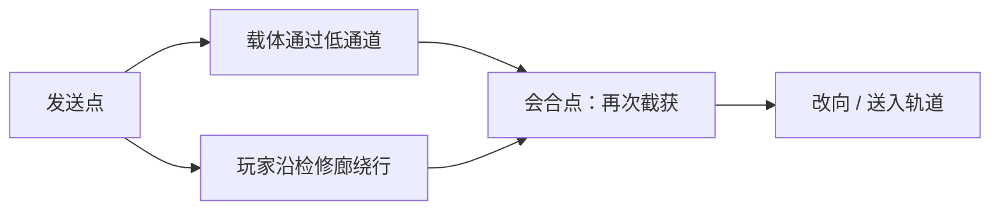

# Transmit / 设计与工程案例

[项目首页](../README.md) · [验证证据](EVIDENCE.md) · [双平台开发](CROSS_PLATFORM.md)

这里记录四项影响过实现或玩家任务的决定。每个案例保留问题、选择、代价和证据边界；源码基线为 [9455e05](https://github.com/Furinasd/Transmit/tree/9455e05e8e7026b90c71dbc2556be74dfdeada6d)，运行记录按各自版本标记。

## 01 空间中继与设计取舍

### 从控制能力到空间问题

早期 L2 围绕方向匹配展开。六向解析、预览和兼容拒绝能支撑这样的谜题，但玩家的主要任务容易变成“对上指定方向”。

后续保留六向作为控制语法，把主线改为：**发送载体 → 玩家绕行追踪 → 在会合点再次截获 → 改向入轨**。一个已经实现的系统可以继续有用，而不必占据关卡的中心。

*空间关系示意，不是按比例的关卡平面图。*

### 保留与改变

| 保留的能力 | 改变的玩家任务 | 增加的制作责任 |
| --- | --- | --- |
| CameraCanonical 六向、拒绝保留、可再次截获 | 从方向匹配转向预测两条路线的会合 | 通道与检修廊关系、视线、载体停靠、失败恢复 |
| 同一 E/Q 交互 | 从取源交付转向分阶段接管 | 让反馈说明“谁持有”“送给谁”“接下来往哪走” |

Carrier 移动 Actor 本体并处理阻挡，运动中仍可再次截获。已知解连续 PIE 能证明这条行动链可执行；它没有证明初次玩家会主动理解中继，或愿意重复使用这个机制。

**下一项有效证据：**让未读设计稿的玩家描述载体会在哪里停、自己应从哪里接管，再观察预测与行为。若只是跟着提示绕路，需重新审视会合点的可读性与决策价值。

**阅读入口：**[Carrier](../Source/passely/Private/Motion/TransmitDirectionalCarrierActor.cpp)、[方向 ADR](Decisions/ADR-003-camera-driven-linear-reroute.md)、[玩法演化](https://app.notion.com/p/3d36dbf617ac81aeaa37c190f5ed04b6)。

## 02 状态交接与唯一所有权

### 为什么把写入集中在组件

Source、Player、Carrier、Receiver 与 Charger 都参与运动资源的流转。如果每种对象自行写入状态，失败路径和表现回调很容易留下“双方都持有”或“双方都没有”的中间结果。

`UMotionTransferComponent::TryMoveBetween` 形成明确的提交边界：

1. 校验来源、目标、提供能力与接收兼容性。
2. 清空来源，将状态交给存储型目标，或由消费型目标消费。
3. 检查后置条件；失败进入恢复与拒绝路径。
4. 状态更新完成后，将事件加入通知队列。

### 必须区分的三个承诺

| 承诺 | 含义 | 不自动包含 |
| --- | --- | --- |
| 单槽 | 每个持有组件至多保存一份状态 | 全世界只有一个 Motion |
| 一次交接不复制 | 成功后来源不再持有被转移的值 | Grant / 再生 / Reset 的所有跨系统组合 |
| 游戏线程事务 | 在受控顺序中先提交，再通知 | 跨线程锁、网络复制或数据库 ACID |

`SourceId` 用于来源溯源，不是全局资源实例注册表。当前后置条件检查指定字段，也不是对全部状态字段的形式化证明。

### 回调重入是怎样被纳入设计的

通知触发后，监听者可能再次请求交接。队列与分派标志将通知按顺序处理，避免表现层在状态尚未提交时参与判断。面向监听者，事件快照描述那次事务，现场查询则可能已反映后续事务；二者不可混用。

可沿 [NotificationReentrancy 测试](../Source/passely/Private/Tests/MotionTransferTests.cpp) 查看嵌套请求、事件顺序和最后的 owner，而不是仅看测试名称。组件与 Actor / Blueprint 接口路径也需分别覆盖。

**阅读入口：**[TryMoveBetween / FlushNotifications](../Source/passely/Private/Motion/MotionTransferComponent.cpp)、[IMotionTransferable](../Source/passely/Public/Motion/MotionTransferable.h)、[测试](../Source/passely/Private/Tests/MotionTransferTests.cpp)。

## 03 离轴反击与预览契约

### 暴露问题的具体操作

旧 Ram 沿 FixedAxis 发射，预览却表达捕获 High 的 PreserveSource 方向。居中操作容易掩盖差异；离轴发射让玩家看到的承诺与设备实际用途分离。

修订将方向转换放在接收端：**Q 消费时计算装置到 Boss 当前地面位置的向量，之后锁定直线行程。** 捕获资源本身仍保留 Dash 来源语义。

| 层次 | 责任 |
| --- | --- |
| 捕获与携带 | 保留 High 的来源方向与方向策略 |
| Interactor | 刷新目标、计算普通方向、提供 Context 与目标预览 |
| Ram | 表达设备最终输出；消费时锁定 `StrokeDirection` |
| 行程与命中 | 移动实体，以实际落点判定 Boss 与门是否满足命中条件 |
| 表现 | 响应状态与结果，不以特效结束回调增加进度 |

### Preview = Commit 的准确范围

按键请求会先 `RefreshTarget`，再将选中目标的 Context 交给提交并复验资格。它不承诺无条件使用上一渲染帧的旧箭头。

普通方向解析结果与 High 设备转换也不是同一字段。Ram 的最终输出会在消费时采样并锁定；世界变化、相机混合及输入顺序仍需要针对性的运行检查。

### 发射成功与命中成功

行程受阻或结束后，`ResolveStrike` 使用 `StrikePosition` 检查 Boss 的二维圆形范围与高度，再检查门包围盒最近点的范围。只有满足玩法命中规则才增加门损伤。

因此：

- 忙碌 / 不兼容的**提交前拒绝**保留输入。
- 成功发射后的**落空**已经消费输入，但不增加进度。
- 两次门损伤分别形成受损与开门反馈。

准确描述是“受控 Sweep 行程 + 基于实际落点的玩法命中判定”。这不是完整刚体冲量模拟，也不是 Q 成功就计分。

### 证据与代价

[体验修订报告](dev/20260907-experience-refinement.md)记录离轴发射、锁定后目标移动、独立落空 fixture 与连续通关。脚本熟练路线不证明 Boss 的首玩公平性；第二轮是否形成主动掌控，也需玩家观察。

当前 Ram 缓存单一 Boss，Carrier 与关卡 Ram 有具体关联。这样的实现服务单图原型，不应称为通用多目标战斗框架。

**阅读入口：**[RequestTransfer / EvaluateCandidate](../Source/passely/Private/Motion/MotionInteractorComponent.cpp)、[GetCounterDirection / ResolveStrike](../Source/passely/Private/Transmit/TransmitLevelActors.cpp)。

## 04 恢复边界与作者验证

### 装置就绪不等于玩家已经入场

玩家可能远程完成 docking，却尚未走过检修廊。若直接用 armed 表示下一阶段，坠落重试就会跳过未经历的内容。

当前会话检查点区分 Learn、Route 与实际 Arena entry。局部重试保留之前的进度，Arena 重试保留 docking 与已提交门损伤，并取消未结束行程；完整 Reset 恢复房间快照。这里没有磁盘存档。

### 一个尚未闭环的反例

玩家反馈携带普通 Motion 进入 Boss 房后无法截获 High。源码中的 `CarrierOccupied` 保护了单槽，关卡仍缺已验证的空槽恢复路径。

它说明两项要求需要同时成立：

- **安全性：**拒绝不能覆盖、丢失或复制资源。
- **可继续性：**从合法状态进入关卡，玩家应有可理解、可到达的继续路径。

下一次验证必须从普通 Motion 满槽入场开始，经过拒绝、保留、已批准的恢复路径、High 截获与两轮反击，再检查局部重试 / 完整重置。本案例保持开放，不把提案当作修复。

### Runtime 正确之外，还有作者消费面

Charger 的历史事故发生在 Details 展开路径，彼时运行自动化、Blueprint 编译和 Map Check 已通过。inline-instanced 对象与同名层级 Category 的递归布局归因仍是高置信假设，metadata-only A/B 未闭环。

事故促成独立的作者烟测：**放置 / 加载 → 选中 → 展开 → 改值 → 保存 → 重开**，继承 Blueprint 还需默认值编辑与编译路径。一次运行测试无法替代它。

**阅读入口：**[RequestLocalRetry](../Source/passely/Private/Transmit/TransmitLevelActors.cpp)、[RoomResetController](../Source/passely/Private/Motion/MotionRoomResetController.cpp)、[开放差额](submission/KNOWN_GAPS.md)、[Details 事故](dev/20260905-charger-editor-authoring-postmortem.md)。

---

进一步的生产判断见 [双平台开发](CROSS_PLATFORM.md)、[BeatMarker 暂停投入记录](https://app.notion.com/p/78e6dbf617ac839ebae2019f284058e8) 与 [制作复盘](https://app.notion.com/p/3d36dbf617ac819c814cc87822241d11)。工具原型有实现证据，尚无效率百分比或跨项目复用收益。
