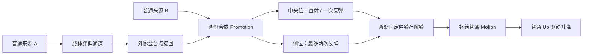

# Promotion｜L4 户晨风二阶段与 L5 空间综合
Notion 主文档：https://app.notion.com/p/3d36dbf617ac813f8760cb795d0aee10
纸面主方案 v0.1 · 2026-09-07。以用户本轮设计为主；L4 = Boss 二阶段，L5 = 机制组合与空间解谜。尚未实装，也未晋升仓库实现契约。数值是首轮原型起点，不是已验证手感或性能。

## 决策
**可以开始截获反馈的小范围实现，以及 Promotion 的隔离技术原型；暂不建议直接制作完整 L4/L5 或并入当前交付包。** 新方案有清楚的设计价值，但二合一所有权、自由瞄准与接收物选择、分裂后的恢复，是三个必须先打通的边界。现有性能审查没有提供可用于扩展放行的前台 CPU/GPU 基线。

本轮只完成设计与评估；不修改 Source、地图、渲染配置或 DESIGN_CONTRACT。当前工作树正在继续演进，旧 26 项测试及旧试玩包不能验证尚不存在的 Promotion。

## 新设计的核心与旧设计的取舍
用户确定的核心：
- Boss 房 E 截获的反馈联系《黑神话：悟空》定身术的骤停与束缚感。
- 普通 Motion 单独不能伤害 Boss，也不能作为苹果折叠屏的有效反击动力。
- 玩家在周旋中获取房内随机出现的普通 Motion；角色左侧显示两格储量；两份合成一格 Promotion。
- Promotion 可自由定向传递给苹果折叠屏，折叠屏分裂为两块高速发射；每块最多反弹两次，两块都能伤害 Boss 或门。
- L4 承担二阶段战斗；L5 承担已学机制的组合与空间解谜。

旧设计只保留四点：新因果要有低压力观察窗口；资源路线与玩家路线分离；至少两条闭合解法；阶段锁存与唯一资源恢复。
曲柄、Angular、Clockwise 检验、旋转锁不再是本主方案的前置；L5 的“先解锁、再普通 Up 驱动升降”结构可以保留，输入改用分裂弹体解锁。不是把新旧两套系统同时实现。

**主题回收：**一份被判“不够格”的普通运动，通过组合产生新用途。Promotion 表示检修器完成的运动合成，不证明户晨风对人的分等有道理。门最终恢复“检修通行”，不把玩家获胜写成加入更高身份等级。

## E 截获：借定身的瞬间，保留 Transmit 的因果
现代码已有成功事务后的预警音停止、0.065 秒局部脉冲、相机反馈，以及 Boss Recovery 回门；不是从零造控制技能。借鉴的是“急动骤停—轮廓锁住—力量抽离”的节奏，不移植法术冷却、法力、技能树或原游戏素材。

建议表现时间线：
1. 成功提交当帧：Boss 的真实 Dash 停止；红色危险轨迹收束。失败、越界、满载拒绝绝不播放成功束缚。
2. 0–70 ms：机械卡扣重音、极短局部明暗反差；镜头仍可转，玩家仍可移动。亮度不过曝，不用全屏白闪或全局时间缩放。
3. 70–160 ms：利用现有回位前短暂停留，在 Boss 本体表面显现三道电路夹箍/断帧轮廓；一条细线把能量拉向左侧储量提示。避免巨大汉字覆盖准星。
4. Boss 开始回门时，实体束缚随之解开，残影在原位淡出；不得让视觉显示“仍被定住”，而真实碰撞已经移动。
5. 到门前以脚下定位光与姿态复原收束。无论命中、落空还是截获，保底回位仍存在。

首版不延长真实控制时间；如 160 ms 内无法读清，优先保留原位残影约 0.3 秒。只有试玩证明不足，才单独评估捕获后的回位停顿。受击碎裂与截获束缚共享电路轮廓语言，但用“向外破裂 / 向内抽离”区分因果。

## 储存、合成与输入：规则必须先闭合
### 两格 UI，不扩成背包
推荐有效持有状态只有四种：空、普通 1/2、Promotion 1/1、Boss High。Promotion 的两格合拢成一个完整菱形；Boss High 用不同轮廓，占用同一工具，不与 Promotion 并存。满载不继续吸取。

第一次 E 仍是现有 Capture。持有普通 1/2 时，对另一份合法普通 Motion 再按 E，执行一次原子合成：旧普通 + 新普通 → 一份 Promotion。记录两个输入的来源与生成序号；两份输入均不再存在，产物有自己的唯一标识。不是把“拿两个状态”藏在 HUD，也不是让加法绕过当前 CarrierOccupied 拒绝。

仅 L4 解锁合成功能。L1–L3 普通单槽行为保持不变。普通一格仍可 Q 给普通载体并完整取回；对折叠屏的普通注入拒绝且保留。普通一格 / Promotion 持有时不能截取 Boss High；Boss High 不参与二合一。这样“选择抓取哪一种来源”是明确成本，不需要切换背包或静默丢资源。

L4 随机资源并非无来源光球：房内检修出口发出可见的短程运动件，E 取走运动后件体停下并回收。一次生成对应一个新实例 ID；同一个停止件不能连续提供两格。供应可以补充新的实例，不复制仍被玩家、载体或弹体链持有的旧实例。

### 自由瞄准不再偷锁 Boss
推荐操作：持有 Promotion，瞄准折叠屏并按住 Q，锁定的是这台发射装置；继续转镜选择发射点，松开 Q 提交。E / 失去范围或视线 / Retry 取消瞄准并保留资源。WASD 不取消，可边走边瞄。瞄准期间 Boss 正常行动。

输出是“发射装置 → 相机瞄准的场景点”的自由三维单位方向；不受六向量化或 Boss 位置锁定。没有命中场景时使用有限距离的瞄准点。两片以该方向为中心形成固定小夹角，预览显示两条真实路径，覆盖最多两次反弹。

这需要局部的接收物锁存与方向预览：当前相机不再必须继续指向装置，但玩家到装置的范围/遮挡仍在提交时检查。发射初始位置也取提交时位置，不能用移动轨道的旧预览坐标。松开 Q 前做最终预览更新；非法目标、过近瞄点、屏体返程中或出口被堵，全部拒绝且保留 Promotion。普通 Q 和 Boss High 的原有操作不受影响。

### 分裂不是资源复制
一份 Promotion 在提交时被消费，产生一次发射批次，包含两块实体屏片。屏片是这次消费的运动结果，不是两份可被 E 重新抓取的 Promotion。
- 同时最多一批、两片；屏片有效期间折叠屏不接受下一发，但玩家可去收集下一份。
- 每片沿固定初速度运动，不追踪 Boss；普通墙碰撞可反弹两次，第三次墙碰撞停止。一次接触只计一次，不把墙角抖动计为多次反弹。
- 每片首次命中 Boss 或门的有效碰撞体就结算伤害并停止；0/1/2 次反弹后的命中都有效，无暗藏“必须反弹才伤害”的规则。
- 两片均有独立伤害资格，同一片不反复伤害同一目标。墙弹只给定位反馈，不产生穿墙范围伤害；L3 原有圆形反击仍保留在 High 冲锤路径，不能把其 Boss 与门的 AND 判定直接复用于新弹体。
- 两片停止或寿命到期后，原件短暂消隐并在机械基座受控归位合拢。返程无伤害、无阻挡；不模拟拾取碎片或 Chaos 自动拼装。
- 初始速度建议 2200–2800 cm/s、最长存活 4 s、总路程上限 9000 cm、夹角总宽约 12–18 度；均需用实际房间尺寸校准。增加速度不能替代命中可读性。

## L4｜户晨风：二次评等
**目标：在持续威胁下把两份普通运动合成 Promotion，用自由发射与反弹解除户晨风的阻拦和终门约束。** 预计 2:30–3:30，尚未实测。

### 空间与阶段衔接
L4 就是原 Boss 房的二阶段，不新造另一座战斗场。L3 两次有效反击打坏外层门面，露出原先可从缝隙预见的内侧固定件，同时打开侧边检修凹位。旧裂缝保持，不突然修好门或复活 Boss。

这是扩展版的 L3 完成出口修订；当前三关交付版仍保留原来两击通关。只有将来明确实现五关版，才改变该分支的通关条件。二阶段可在同一关卡中由一个 encounter phase 值协调，不需要 Level Streaming 或第二套 Boss AI。

保留门前 home、中央发射区和外侧周旋环。场内有少量侧掩护，两面平整、可识别反弹墙；装饰棱角不参与反弹。随机出口分布在左右侧与后侧，不能全部位于一块永久安全掩体后。高差只用于入口预读与观察，不在高速弹道核心引入跳跃平台。

### 三拍教学，不在第一秒倾倒全部规则
1. **旧认知回收（约20–30s）**：保留一份普通 Motion 对屏体拒绝/此前弱试撞的记忆；左侧出现第一格。凹位能暂时挡住 Boss，但不能覆盖两处取能点。
2. **首次合成（约30–45s）**：前两次供能按安全的作者点位出现，不随机。第二次 E 两格合拢，屏铰链张开；首次 Q 预览直射与侧墙反弹，玩家选一种完成真实命中。短提示仅在该时刻出现，Tab 可重看。
3. **自主周旋（其余时间）**：进入有约束的随机供能。Boss 仍瞄准玩家、锁定后冲刺、每轮回门。玩家决定先避险拿第二格、利用直射窗口，还是从侧面借墙反弹。

### 两条合法作战路线
- **近端直射**：在开阔区引导 Dash，侧移后到折叠屏有效操作范围，等 Boss 回位时自由直射。路径短，暴露高。
- **侧翼反弹**：在外环取能，站在能看到屏体的侧位，朝反弹墙发射；弹体从侧面回到门前。走位较长、几何判断较多，但减少正面暴露。不是追踪弹；Boss 位移后仍可能落空。

Boss High 路径保留为已学手段：空槽截获后仍能驱动原本反击并造成 Boss 反馈。持有 High 会令 Boss 在门前等候，但它也占住工具，无法同时囤普通 Motion；不得出现“定住 Boss 后无风险一直刷 Promotion”。内侧门固定件位于旧锁 Boss 的单体冲锤覆盖不到的侧向位置，Promotion 自由分裂弹可命中；通过真实几何要求新能力，而不是突然宣布 High 无效。

### 随机必须可读、可达、可复现
推荐 6 个作者确认出口、最多 2 个活动资源。每 0.5 s 或资源消费事件才检查补给需求；候选点排除当前锁定冲刺走廊、Boss 回位带、已占用点、不可达点与重复近点，不每帧重抽坐标。
第一次固定配对之后才随机；用种子袋选点，连续两次不出同一点。开口亮起约 0.8 s 后才出件；未取的资源保持到消费/重试，不用短寿命逼玩家追逐。
若玩家只有 1/2、且没有有效第二份，最多约 3 s 后从最近合法保底点补齐。没有安全候选时先等一次 Boss Recovery，再投放；不能把资源生成在玩家脚下或危险中强行满足计时。
一次随机选择最多考察 6 个预置点。Actor 在场不等于唯一性丢失：活动实例、玩家持有、转换产物和已消费状态要能追溯。

### 胜利与叙事
纸面调参起点：Boss 两次有效失衡，门两处固定件分别损坏；每块屏片可以打 Boss，也可以打门，均按实际碰撞结算。两类进度独立可读，完成两者后开启 L5。这只是小型 encounter progress，不扩成通用 HP/护盾/装备系统；数字需在灰盒中验证是否拖长战斗。
同一发的两块屏片允许各贡献一次；不要为了凑时长无提示吞掉第二片伤害。直射、一次反弹、两次反弹没有额外倍率。
户晨风在两格合成后仍可说“凑在一起，也算升级？”；随后两块屏体从他的侧面打掉固定件。最终保留门原有检修公告，移除自封分等告示。台词在安全空隙播放，不解释答案、不暂停战斗。

## L5｜接续总线井
**目标：先用分裂/反弹解除两处机械固定，再以普通 Motion 驱动升降平台离开。** 预计 2:30–3:30。无新敌人、运动类型、按钮或升级；把 L4 的反弹对象换为有同样受击规则的机械固定件。

### 空间关系
高处入口能同时看见终点升降机、左右两个固定件、低处输运通道、外环步道和一面公共反弹墙。入口看得懂因果，但不能在入口直接完成所有交互。
两份固定普通来源 A/B 位于不同空间：A 可先交给载体穿低通道，玩家走外廊后接回；B 在会合点附近。L5 取消 L4 的随机投放，让解谜失败来自规划而非抽签。
会合台上的检修型折叠屏复用 L4 的分裂发射与归位能力，固定基座，避免增加“解谜同时追移动炮台”。原场地那台 C-01 仍留在 L4，第二台是明确的同类装置，不伪装成同一 Actor 瞬移。
升降机输入面初始被两处固定结构遮住。完成解锁后才暴露普通输入和上升标记；操作面与平台共位，不增加启动后追电梯的新时序题。

### 主解：长路、少反弹
1. 从 A 截获普通，Q 给载体；载体走低通道，玩家沿外廊到会合点 E 取回同一份运动。
2. 对 B 再 E，合成 Promotion；两个来源均消费，形成一次可追溯产物。
3. 沿开放步道到中央操作位，按住 Q 锁屏并瞄准两处固定件；使用直接路径或一面墙的一次反弹。
4. 命中会锁存对应固定件，已打开的部分不会因下一发落空复原。两片的出射角与目标间距要在灰盒中共同标定，允许一发同时解开两处；不能只在示意图上画成成功。
5. 若尚缺一处，用补给点重新取得两份普通，再完成它。主解不能依赖一发必杀才能资源闭合。
6. 解锁后普通来源补充新实例，取一份普通，站在升降平台瞄准输入，按旧六向规则预览 Up 再 Q；输入消费、平台升起、回看已修通的输运路径。

### 替代解：短路、两次反弹
资源链相同，在侧翼较近操作位朝公共反弹墙发射。两片分别经作者标定的墙面到达固定件，单片最多两次反弹；省下绕到中央位的路程，代价是读墙面和角度。
不是另一枚开关或专属钥匙。必须记录具体发射点、方向、碰撞序列和目标，证明现有弹道确实可以抵达；当前图只说明功能关系，不证明几何解已成立。
一片先解锁、另一片落空也属于有效部分进度；重取资源后可改用主解，不需要关内 Reset 强迫重来。

### 资源不会被解谜进度吃死
L5 的 A/B 在上一发输入完成消费、且仍有固定件未解锁时可补充新实例；最多两份活动普通资源，持有量与正在运输的一份也纳入供应判断。已经装载 Promotion 时不继续灌满场景。
固定件全部解锁后只供应升降需要的一份普通；不能逼玩家用 Promotion 拆回普通。地图跨出交互范围的异常资源使用本阶段重试恢复，不凭空复制仍被某载体持有的同一输入。
如果玩家在解锁瞬间已持有多余 Promotion，平台旁的既有同类检修屏允许发射消耗它，或本阶段重试清除临时持有再提供普通；不新增分解按钮。

## 失败恢复是同一设计的一部分
- L4 局部重试：保留 L3 外门损坏与装配成果，保留 L4 已提交 Boss/固定件进度；清空临时持有、随机源、瞄准锁存、两片弹体和未结算命中，Boss 回门、屏体完整归位。若固定件全开而 Boss 尚未完成，保留可用战斗资源，不提前退出。
- L5 局部重试：保留已解除的固定件；只恢复未完成子阶段所需资源、载体和玩家安全点。全解锁后落入升降阶段，不要求再射门。
- R：恢复本扩展关卡入口快照，清除所有阶段进度、供能实例、弹体批次、叙事与 UI；重置随机种子以复现本轮布局选择。
- 每个命中带发射批次与关卡运行序号；Reset 后到达的旧回调不能伤害新门。没有“旧弹片还在飞，新屏体又可开火”的重入路径。
- 分裂前预留两片可用对象；任一片无法启用则整个 Q 拒绝并保留 Promotion，不能先扣资源再发现只生成半片。

## 实现边界与成本
源码事实来自本轮实际读取：
- MotionTransferComponent::CanReceiveState 在已持有时返回 CarrierOccupied；TryMoveBetween 是一对一事务，没有二输入转换。
- ArenaCharger::Tick 已有追踪玩家、捕获后回门，以及持有该 Boss High 时等待；正常 1/2 与 Promotion 不应被误判为 Boss High。
- Ram::ResolveStrike 的旧门进度依赖 Boss 与门同时处于圆形范围；新两片弹体需要独立目标结算，不能复制旧 AND 条件。
- PresentationRig::OnTransaction 已有 High 截获成功反馈，三层实例池各 256；当前 FinishStrokes 仍更新实例并标记 render state，池有界不等于 GPU/RenderThread 免费。
- 本机 Engine/Build/Build.version 为 5.8.2。引擎已提供 UProjectileMovementComponent 的 sweep、bounce、迭代参数与回调；本项目尚未实现这套 Promotion 弹体。

推荐最小责任分配：
- Motion 核心：一个受限的二输入转换事务，保留唯一 owner、拒绝保留与完整来源链。不得由 HUD/关卡导演直接 Set/Clear 两个资源拼成“成功”。
- 玩家交互：仅 Promotion 的 Q 按住锁装置、自由瞄准、松开提交分支；普通 resolver 不重写。
- 折叠屏：预留两片、一次消费、发射批次、合拢与再接收时机。L4/L5 出现第二种使用后才提炼共同能力，放置/移动方式仍由各关配置。
- 弹体：简单碰撞根 + UProjectileMovementComponent，重力零、非物理模拟、无 homing；反弹两次计数和目标伤害均在成功碰撞事件结算。
- 关卡导演：只负责 L4/L5 阶段、有限随机补给、进度锁存和 Reset；不拥有 Motion。
- 表现：订阅实际状态，复用池、音效、动态材质；无 GAS、行为树、通用背包、Chaos 破碎或新的任务系统。

熟悉本仓库的一名 UE 开发者估算（非承诺，包含该项基本验证）：
- E 定身感表现：4–8 小时，难度低至中，当前最高 ROI。
- 二输入合成、来源链、拒绝与 Reset：12–20 小时，难度高，最高正确性风险。
- 自由瞄准、两片发射/反弹/归位：12–20 小时，难度中高；主要是预览与碰撞边界。
- L4 供能点、二阶段与教学迭代：8–16 小时，难度中；认知负担风险高于 Actor 数量。
- L5 两条真实几何解与升降组合：12–20 小时，难度中高，必须实际摆图验证。
- 同候选回归、性能 A/B、打包与试玩修正：12–20 小时。
合计约 60–104 小时；不含新角色骨骼/动画制作、原创高规格音美术资产及大规模返工。4–8 小时可以做风险原型，不能据此承诺完整高打磨关卡交付。

## 性能边界：先限制活动量，再测真实开销
以下是建议的首轮预算，不是 UE 的官方上限或已测结果。
- 1 Boss、1 屏体、2 弹体、最多 2 活动普通源、6 个预置供能点；跨 L4/L5 不同时激活两组内容。弹体与源复用，空闲时关闭 Tick/碰撞。
- 一次弹体飞行最多 3 段墙间路径；同一帧可能跨多个接触，必须 sweep，不能“位置 += 速度 × dt”后只查终点。
- 起测参数 MaxSimulationIterations=4、BounceAdditionalIterations=0、MaxSimulationTimeStep≈1/60 s；这是移动组件迭代预算，不是所有碰撞查询的绝对上限。记录真实 sweep 数；低帧率最后一步可大于该步长，不能声称开 substep 就绝不穿透。
- 瞄准预览最多 20 Hz、两条路径每条最多 3 段，约 120 次路径 sweep/s；Q 松开强制一次当前状态重验。只在方向、屏位置或碰撞环境变化时更新可减少开销；动态 Boss 的未来位置不承诺预知，预览只承诺发射几何规则。
- 每片最多一条短尾迹，停止即衰减；截获、反弹、命中共享现有实例预算，不叠一套常驻 Niagara。池满先裁装饰，不能裁准星、危险线、命中状态或资源计量。
- 左侧储量用 HUD 投影角色胸侧锚点，屏幕左偏约 45–65 px，两格形状加数字，随视角平滑但不长距离追随；不使用每帧刷新的 Widget RenderTarget。遮挡/贴墙时贴近屏幕安全区，不隐藏关键容量。
- 小型发光尾迹不新增动态投影灯，不让每次捕获改变太阳、天空捕获或全屏后处理。太阳过渡只在关卡段落发生，稳定后停止更新。高动态光和透明过绘比两块简单刚体更值得重点测。

临时以 60 FPS 作为比较目标时总帧预算为 16.67 ms；仍须确认目标机、分辨率、画质。新增机制起测目标可设为 p95 GameThread 增量 ≤0.3 ms、p95 GPU 增量 ≤0.5 ms。二者并行，不能直接相加当总帧时；超预算先归因，不擅改全局 Lumen/VSM 设置。
测量条件固定代码/地图 hash、5.8.2、Mac Metal、独立包前台、分辨率与画质；预热后每种场景 30–60 秒、至少三次，记录 p50/p95/p99、GT/RT/GPU、分配、活动对象、sweep 与池溢出。用 Unreal Insights 定位 CPU/加载，GPU 对应 pass 单独看。
比较基线、仅截获反馈、仅合成/发射、全效果四组；覆盖首次加载、两片同时弹墙、Boss 回位+取能+命中重叠、反复落空、连续20次Retry/R。内存与对象数应回到稳定平台；平均 FPS 和打包秒数都不能代替这些数据。

## 开工判定与退出条件
**绿灯：** E 截获表现可独立开工，前提是不改变事务与真实控制时序，并在现有 Boss 回位内验证。
**黄灯：** Promotion 可开始隔离于 L_TestChamber 的 4–8 小时风险验证：两份真实 Source → 两次 E → 一份 Promotion → Q 自由方向 → 两片 → 两次反弹 → 独立命中 → Retry/R。
**暂不放行：** 完整 L4/L5 场景制作和正式包整合。理由是新资源事务与瞄准手势尚无运行证据，前台性能余量尚未建立；不是因为“UE 做不了反弹”。

进入正式实现前的完成定义：
- 第二次 E 成功一次，两份输入消失且只剩一份产物；输入失效/满载/重入/Reset 时没有损失或复制。
- 同一目标源不能反复刷两格；普通/High/Promotion 的接收与容量规则在 UI、Preview、Commit 一致。
- 自由方向确实不锁 Boss；Q 持有期间可移动；释放时装置失效/挡住/返回中能正确拒绝。
- 两片分别覆盖 0/1/2 次反弹命中，第三墙碰撞停止；薄墙、墙角、初始贴墙、30/60/120 FPS 与故意 100 ms 卡顿均有证据。严重卡顿无法保障预览一致时明确支持边界。
- Boss 每次 Dash 回门；持有普通/Promotion 不停止 Boss；持有 High 不允许兼收普通，无安全无限蓄能。
- L4 随机供给在至少 20 个固定种子下均可达、可补齐、不在危险线刷脸；失败可切换另一条路线。
- L5 两条路线各提供实际发射点/方向/碰撞序列与完整通关记录；任一失败后资源链仍闭合。
- 20 次 Retry/R 后无残留 projectile、旧批次伤害、重复源、错误 UI 或孤立半屏。
- 新 UPROPERTY/组件的 Details 与继承 Blueprint 经修改、保存、重开验证；编译不替代作者入口检查。
- 一组前台同条件性能 A/B，加无口头提示试玩：能说清两格合一、自由方向与反弹次数；L4 不把随机取能玩成无聊绕圈，L5 不靠试遍角度蒙中。

若风险原型发现必须重写普通 Motion 核心或引入通用背包才能成立，先缩小实现方案而非削弱用户规则；如两片自由反弹难以读懂，优先修墙面、角度预览和速度，不静默改成追踪弹或脚本必命中。

## 来源与证据范围
- 用户本轮设计与两次修正：新设计优先；L4=Boss二阶段，L5=机制组合/空间解谜。
- [旧 L4｜Motion Conversion](https://app.notion.com/p/cb36dbf617ac8380844f81e6ec873ddc)、[旧 L5｜System Synthesis](https://app.notion.com/p/b596dbf617ac83ba88ed818940c25571)：只提炼安全教学、双路线、顺序与恢复，不沿用 Angular 主线。
- [04｜任务、世界与演出](https://app.notion.com/p/a1d6dbf617ac83f091088183c88004ba)：玄武能量、巨型主机、分等官与检修通行的叙事关系。
- [11｜架构与性能审查](https://app.notion.com/p/3d36dbf617ac81cebe65c0adfaefd9d0)：这是历史源码审查快照，提供验证方法与风险，不把旧 WIP 发现称为今天全部仍存在的缺陷。
- 当前本地 Docs/DESIGN_CONTRACT.md、Docs/ARCHITECTURE.md，以及 MotionTransferComponent.cpp、MotionInteractorComponent.cpp、TransmitLevelActors.cpp、TransmitPresentationRig.cpp：本轮只读核对；没有重新运行现有 Demo 或给新机制编译证明。
- [Epic UProjectileMovementComponent](https://dev.epicgames.com/documentation/en-us/unreal-engine/API/Runtime/Engine/UProjectileMovementComponent)：引擎提供 swept movement、bounce 与迭代控制；本机 5.8.2 头文件同时核对了步长警告。
- [Epic Unreal Insights](https://dev.epicgames.com/documentation/en-us/unreal-engine/unreal-insights-in-unreal-engine)：性能采样工具依据；本轮预算均为待测项目建议。
