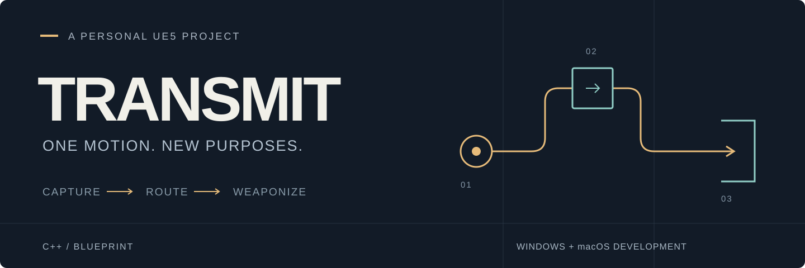
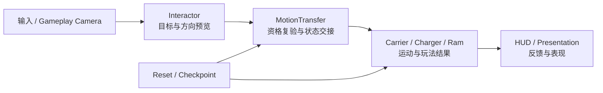

<p align="center">
  
</p>

<p align="center">
  <strong>把世界已有的运动，交给新的用途。</strong><br>
  个人 UE5 空间交互原型 · C++ / Blueprint · Windows / macOS 开发
</p>

<p align="center">
  <a href="https://www.bilibili.com/video/BV1gXYT6dEeY/"><strong>观看实机演示 ↗</strong></a>
  &nbsp;·&nbsp;
  <a href="https://app.notion.com/p/e916dbf617ac8213bf0b01b2bde83939">玩法与制作作品集</a>
  &nbsp;·&nbsp;
  <a href="Docs/CASE_STUDIES.md">设计与工程案例</a>
  &nbsp;·&nbsp;
  <a href="Docs/EVIDENCE.md">版本与验证证据</a>
</p>

---

## 一份运动，三种用途

**Transmit** 是一个基于 Unreal Engine 5.8 的第三人称战斗解谜原型。玩家扮演巨型电子主机中的临时检修工，截获物体或敌人的 **Motion State（运动状态）**，再交给新的载体：接通断桥、穿越维修通道，最终将敌人的冲锋转为打开出口的力量。

核心操作始终是 **E 截获 / Q 传递**。变化的是玩家要理解的空间关系，以及运动在其中的用途。

| 01 · Learn | 02 · Route | 03 · Weaponize |
| :--- | :--- | :--- |
| **改变通路** | **组织路线** | **利用威胁** |
| 拿走来源的运动，让桥板接通道路。 | 让载体先抵达，沿检修廊追踪，再次截获并送入轨道。 | 在冲锋窗口截获 High Motion，驱动反击装置，两次有效命中后离开。 |
| 建立“归谁持有，就由谁运动”的基础理解。 | 推理玩家路线与载体路线如何会合。 | 在时间压力下运用已经学会的交互语言。 |

三段连续呈现在单张 `L_Transmit` 中；`L_TestChamber` 保留为能力实验与回归入口。L4 / L5 的扩展设计另行归档，未计入当前可玩范围。

**实机演示：**[Transmit —— 个人 UE5 空间交互 demo](https://www.bilibili.com/video/BV1gXYT6dEeY/)。作者确认视频来自最终提交版 Windows 独立包；精确源码 SHA 与候选编号仍待关联。页首图为概念示意，实际画面以视频为准。

## 项目职责

我主导玩法规则、关卡递进、架构边界与体验取舍，使用 C++、Blueprint 和 Agent 辅助实现及制作。项目保留设计演化、故障与验证记录，让关键决定可以沿源码和实际结果追溯。

| 关注点 | 本项目中的具体工作 |
| :--- | :--- |
| **玩法与空间** | 从方向匹配转向空间中继；用同一套 E/Q 连接解谜与 Boss 反击。 |
| **系统与反馈** | 管理状态交接、方向解析、接收端输出、真实落点判定与分层恢复。 |
| **开发与交付** | 处理 Windows / macOS 的编译、工具生命周期与封包差异；区分运行、作者工作流和玩家验收。 |

贡献与素材来源见 [制作职责与来源](Docs/CREDITS.md)。

## 值得深入的四个问题

### 01 / 一次交接，怎样留下可信的世界状态？

`FMotionState` 以值携带运动类型、方向、强度与来源标识。`UMotionTransferComponent` 集中执行交接：先检查来源、接收能力和兼容性，再修改状态，最后派发通知。

单槽、拒绝保留、消费型接收端与通知回调重入围绕同一事务边界处理。这里的“原子”指游戏线程上的状态提交；来源标识用于溯源，不代表全世界唯一资源实例登记。

[阅读：状态所有权与失败边界](Docs/CASE_STUDIES.md#02-状态交接与唯一所有权) · [源码](Source/passely/Private/Motion/MotionTransferComponent.cpp)

### 02 / 预览正确，为什么装置仍可能打偏？

普通 Linear 由 gameplay camera 量化为世界六向，阈值与滞回稳定方向边界。解析结果经 `FMotionTransferContext.DirectionResolution` 传入提交；按键时刷新目标并复验资格。

离轴反击暴露了更深一层：输入方向不等于设备最终输出。当前 Ram 在 Q 消费时确定指向 Boss 的地面向量，锁定后直线运动；预览表达接收端用途。**资源交付、实体发射、实际命中分别处理，落空不计进度。**

[阅读：离轴反击与预览契约](Docs/CASE_STUDIES.md#03-离轴反击与预览契约) · [源码](Source/passely/Private/Transmit/TransmitLevelActors.cpp)

### 03 / 系统规则正确，整段体验就一定能恢复吗？

房间 Reset 恢复权威快照；Learn、Route、Arena 三段会话检查点保留已完成进度。远端装置就绪与玩家实际入场分别记录，避免重试跳过尚未经历的内容。

满槽携带普通 Motion 进入 Boss 房仍有开放的恢复缺口。这个案例让“保护资源的不变量”和“玩家总能继续”的要求同时进入审查，而不只检查作者默认的通关路线。

[阅读：恢复边界与作者验证](Docs/CASE_STUDIES.md#04-恢复边界与作者验证) · [已知差额](Docs/submission/KNOWN_GAPS.md)

### 04 / 同一套玩法，如何进入 Windows 与 macOS 开发流程？

共享 Runtime 与关卡，平台差异集中在编译、Editor 工具进程和分发层：MSVC 窄化转换修正、Editor-only 插件与 Cooker 监听隔离、两套平台封包入口，以及 Mac Python 自动化退出生命周期的防御性缓解。

已有 Windows 成功封包 / 离屏启动，以及历史 Mac 封包 / 签名完整性 / Metal SM6 启动记录。各项绑定自己的版本；Mac 一次受控退出成功保留为缓解证据。

[阅读：双平台开发与兼容证据](Docs/CROSS_PLATFORM.md) · [运行与封包](Docs/PACKAGING.md)

## 实现一览



C++ 承担状态不变量、交接、方向解析、受控运动与恢复；Blueprint 和 Unreal 资产承担装配、输入接线、配置及表现内容。关卡流程和部分表现也有专属 C++ 实现。当前保持一个 Runtime 模块，具体职责与源码入口见 [文档导航](Docs/README.md) 和 [架构说明](Docs/ARCHITECTURE.md)。

## 运行项目

需要 **UE 5.8、对应平台 C++ 工具链、Git 与 Git LFS**。Windows 需匹配引擎的 Visual Studio C++ 工具链与 Windows SDK。

```bash
git clone https://github.com/Furinasd/Transmit.git
cd Transmit
git lfs pull
```

使用 UE 5.8 打开 `passely.uproject`，完成模块编译，在 `/Game/Transmit/Maps/L_Transmit` 中启动 PIE。仓库展示名为 **Transmit**；工程与模块保留 `passely`，以保持序列化引用。

| 移动 | 交互 | 帮助与恢复 |
| :--- | :--- | :--- |
| WASD / 鼠标 / Space | E 截获 / Q 传递 | 按住 Tab 查看帮助；Backspace 局部重试；R 完整重启 |

Windows / macOS 封包命令、产物结构与人工验收路径见 [PACKAGING](Docs/PACKAGING.md)。Windows 分发需要完整目录，不能只发送 EXE。

## 验证与当前边界

| 已有证据 | 覆盖范围 |
| :--- | :--- |
| **27 项历史自动化通过** | 指定检查点下的规则与回归；不能代替玩家体验。 |
| **连续正式地图 PIE** | 166.754 游戏秒的熟练脚本路线，无传送 / 资源注入；不是首玩时长。 |
| **Windows 与 Mac 交付记录** | 各自的历史构建、封包及有限启动观察；不是同一候选双端完整验收。 |

当前开放项包括满槽入场恢复、SUV / 折叠屏视觉身份、Windows 启动 `GameFeatureData` ensure、完整人工清单与前台性能。首次玩家理解与 5–7 分钟节奏仍需测量。详见 [证据账本](Docs/EVIDENCE.md)；当前运行记录与纸面扩展分别保留。

---

**继续阅读** · [设计与工程案例](Docs/CASE_STUDIES.md) · [双平台开发](Docs/CROSS_PLATFORM.md) · [设计契约](Docs/DESIGN_CONTRACT.md) · [作品集](https://app.notion.com/p/e916dbf617ac8213bf0b01b2bde83939)

<sub>展示整理：2026-09-13。文档整理不产生新的运行验收；每条证据保留其来源版本。</sub>
